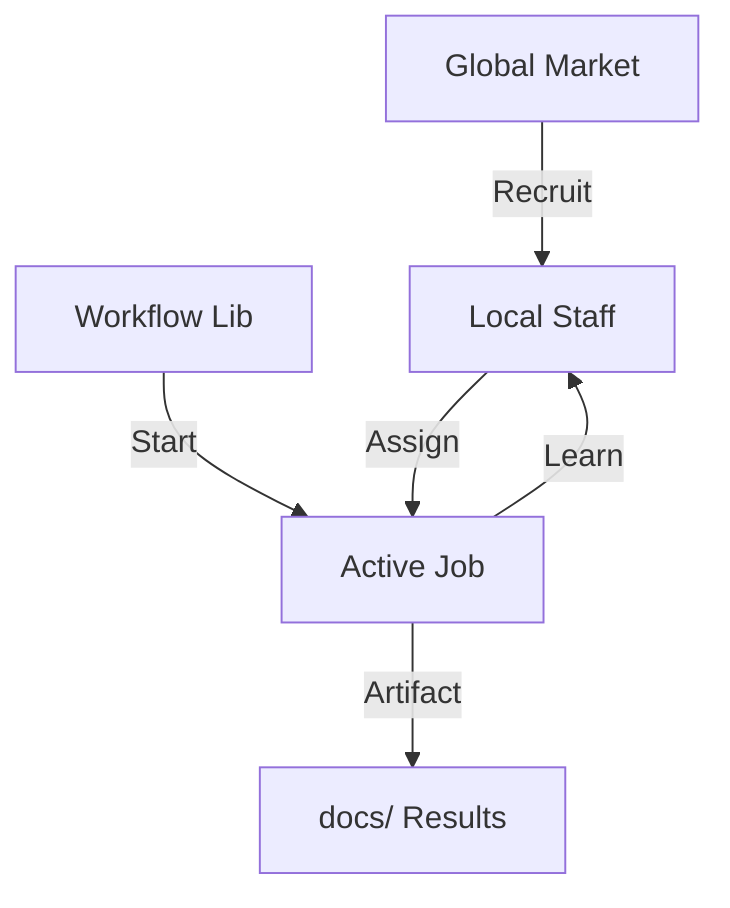

# 아키텍처 설계서 (ACR): TeamBuilder AI Orchestrator

## 1. 개요 (Overview)
본 문서는 TeamBuilder 시스템의 기술적 구조와 설계 결정을 기록합니다. 핵심 목표는 **"유연한 인력 배치와 전문가의 지속적 성장"**을 지원하는 파일 기반의 오케스트레이션 엔진을 구축하는 것입니다.

## 2. 설계 원칙 (Design Principles)
- **Local Priority**: 전역 템플릿보다 프로젝트 내 로컬 설정을 항상 우선시합니다.
- **Role-Job Decoupling**: '누가 할 것인가'와 '무엇을 할 것인가'를 분리하여 동적 할당을 가능하게 합니다.
- **Persistence by Markdown**: 모든 페르소나와 작업 결과는 사람이 읽을 수 있는 마크다운 형식으로 저장됩니다.

## 3. 핵심 컴포넌트 (Core Components)

### 3.1. Hub (Market & Staff Manager)
- 글로벌 인력 시장(Global Roles)과 프로젝트 내 상주 인력(Local Roles)을 관리합니다.
- 계층적 디렉토리 탐색 기능을 통해 수천 명의 전문가를 카테고리별로 관리할 수 있습니다.

### 3.2. Mission Control (Workflow & Job Manager)
- 프로젝트의 전체 여정을 관리하며, 현재 진행 중인 Job(Step)을 추적합니다.
- `state.json`을 통해 프로세스의 원자성(Atomicity)을 보장합니다.

### 3.3. Bridge (Dynamic Assigner)
- **핵심 로직**: `Workflow Step`에서 요구하는 `Base Role`을 확인하고, 사용자가 `LOCAL_ROLES`에서 명시적으로 지정한 `Specialist`가 있다면 이를 최우선으로 매핑합니다.
- 매핑 순서: `Manual Assign (Local)` > `Automatic Match (Local Specialty)` > `Default Role (Global Base)`.

## 4. 데이터 흐름 (Data Flow)

## 5. UI/UX 설계안 (Web Dashboard)
- **Tech Stack**: Bun + Vite + React + TailwindCSS.
- **Communication**: 기존 CLI 엔진을 Sub-process로 호출하거나, `state.json` 및 폴더 구조를 직접 Watch하여 동기화합니다.
- **Layout**:
  - 좌측: 인력 시장 및 팀원 목록.
  - 중앙: 현재 작업 중인 Job의 프롬프트 및 산출물.
  - 우측: 전체 워크플로우 타임라인.

## 6. 향후 과제 (Future Work)
- **`assign` 명령어 구현**: 특정 단계에 전문가를 수동 배치하는 로직 추가.
- **Dashboard 초기화**: `npm create vite` 기반의 웹 프로젝트 구조 생성.
